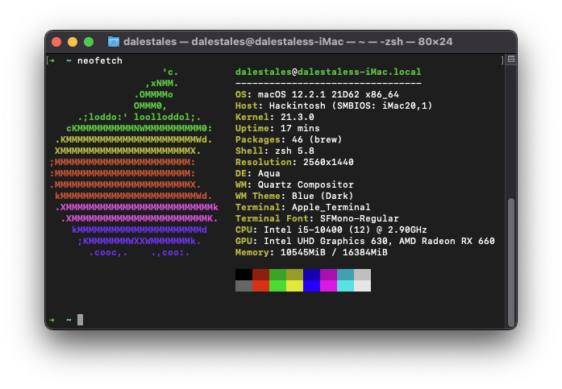
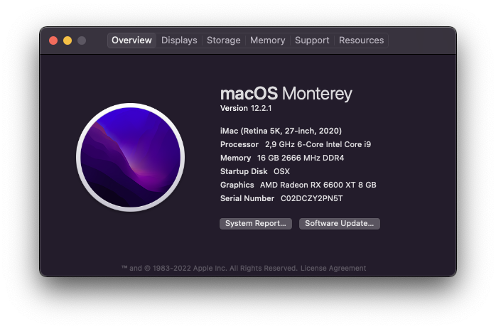
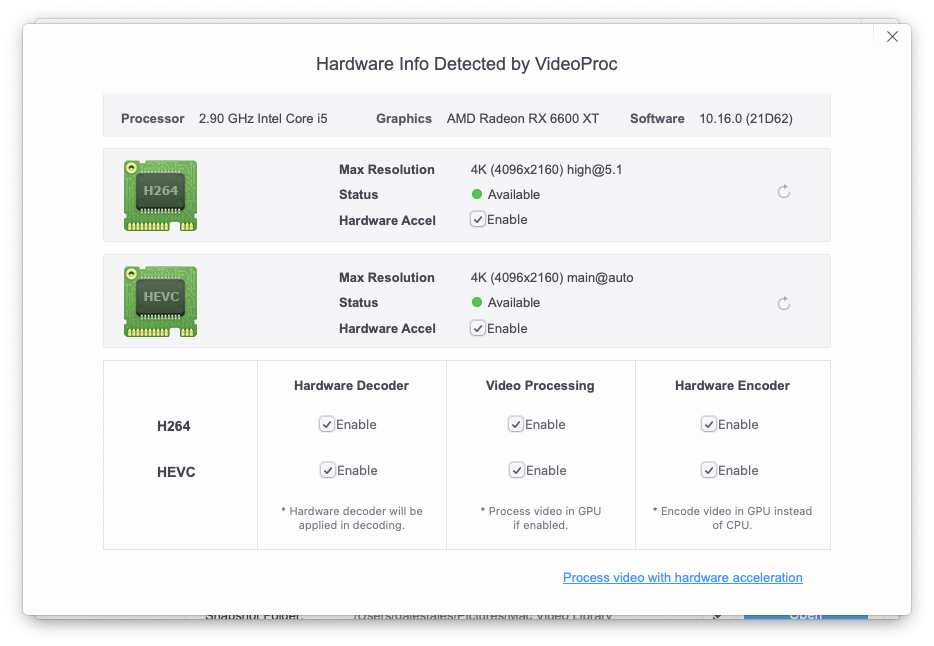
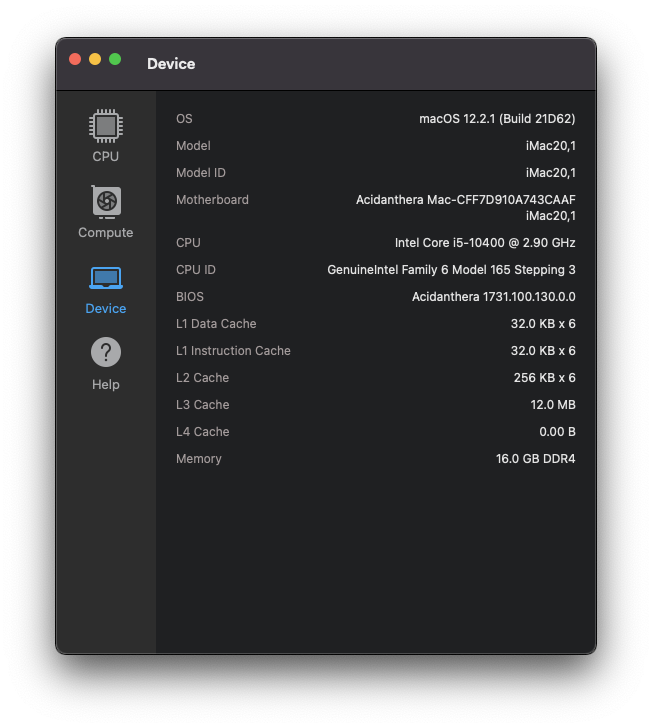
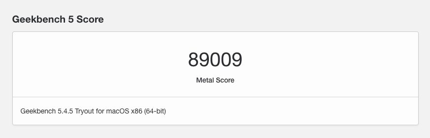

# [oc-asus-h470i] Opencore 0.8.0 macOS Monterey setup.

# Gotchas
- The installer went trough with the iGPU displayport cable.
- 3 out of 4 USB Stick were not OK, and the 4th (Adata 32gb) worked first try flawlessly (root image verification so I was stuck on [EB|#LOG:EXITBS:START]), the USB port also matter, i used to closest USB 2.0 to the ethernet adapter in my case
- Prev install was Big Sur, the Monterey install went on top if it (all data is kept, nice upgrade)
- Monterey ignored USB devices first so i had to use [UsbToolBox](https://github.com/USBToolBox/tool)

# Notes
There is 2 EFI folders for sample, the EFI inside the install folder was used to install Monterey!

# Tools used to create the EFI
- Opencore Configurator (To mount the efi, validate config)
- ProperTree (To do the snapshots)
- SSDT-s precompiled
- Hackintool (To verify current OC version between the swaps)

# Hardware

 [MOBO]: Asus Strix H470-I   
 [CPU]: Intel i5-10400   
 [RAM]: G.Skill TridentZ 3200mhz 16GB  
 [CASE]: NZXT H1  
 [POWERSUPPLY]: N/A  
 [GPU]: ASRock RX6600 XT Challenger    
 [STORAGE1]: Samsung 970 Evo 500GB    
 [STORAGE2]: Samsung 860 500GB   
 [STORAGE3]: Crucial 1TB   

# OS
 [OSX]: Opencore 0.8.0   
 [WIN]: Windows 11   
 [NIX]: Garuda   

